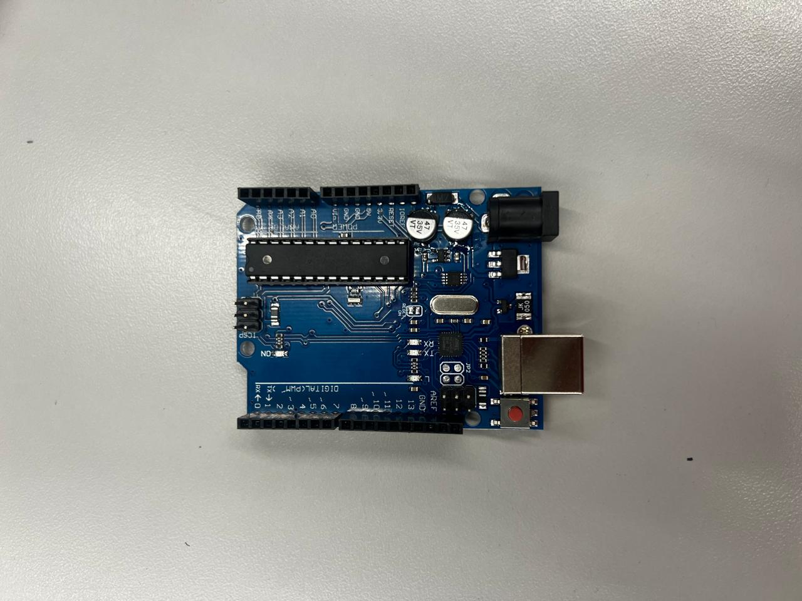
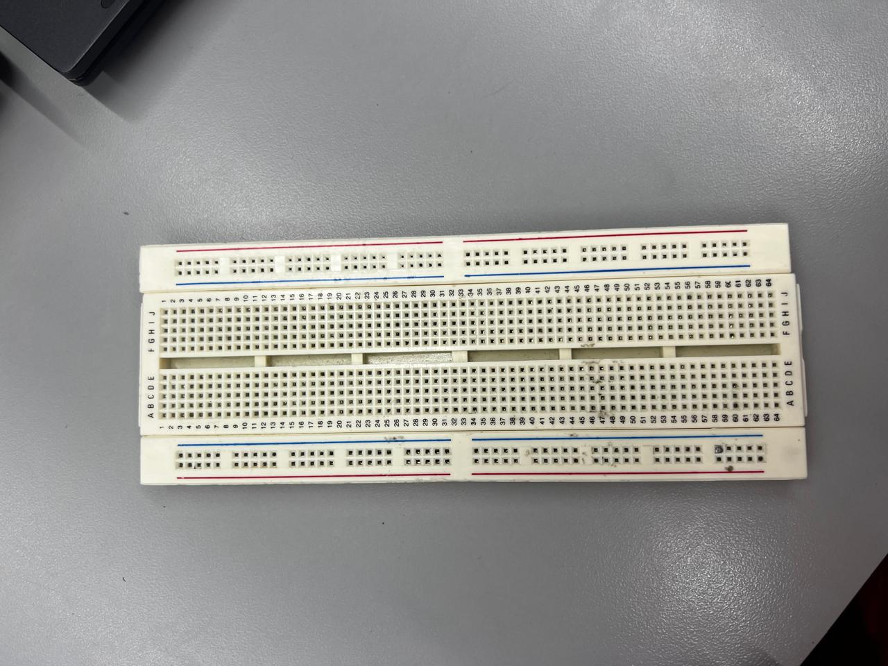
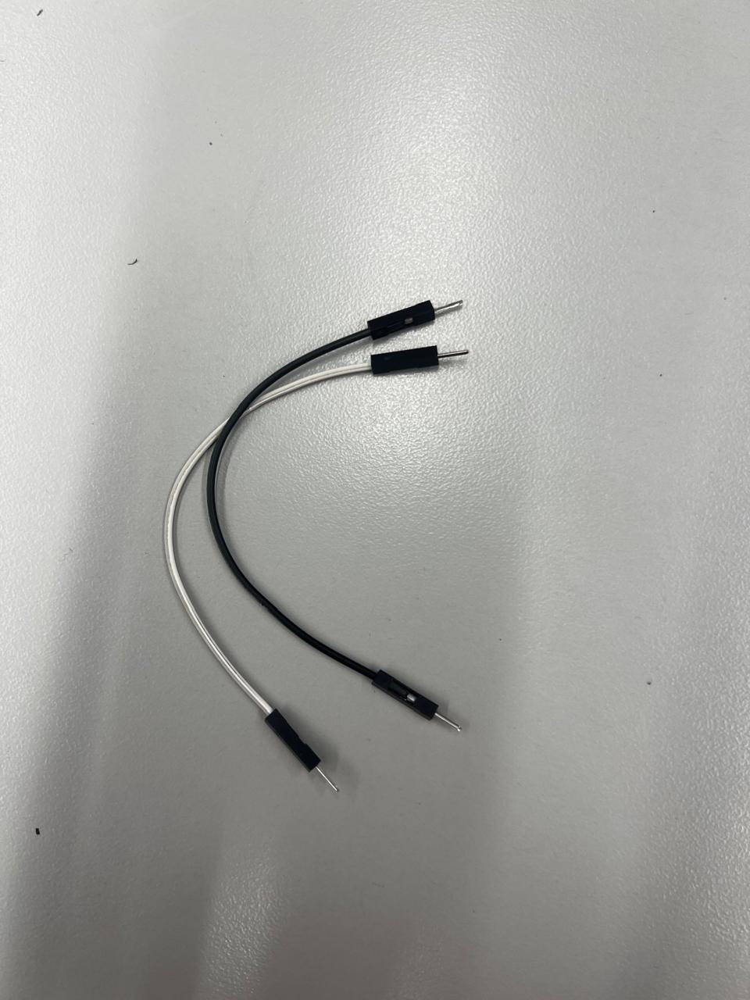
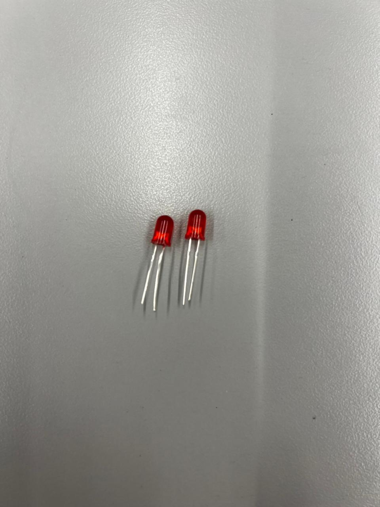
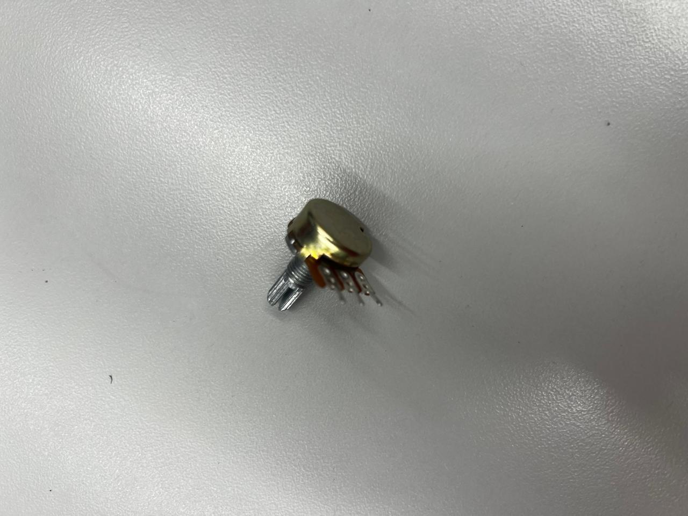
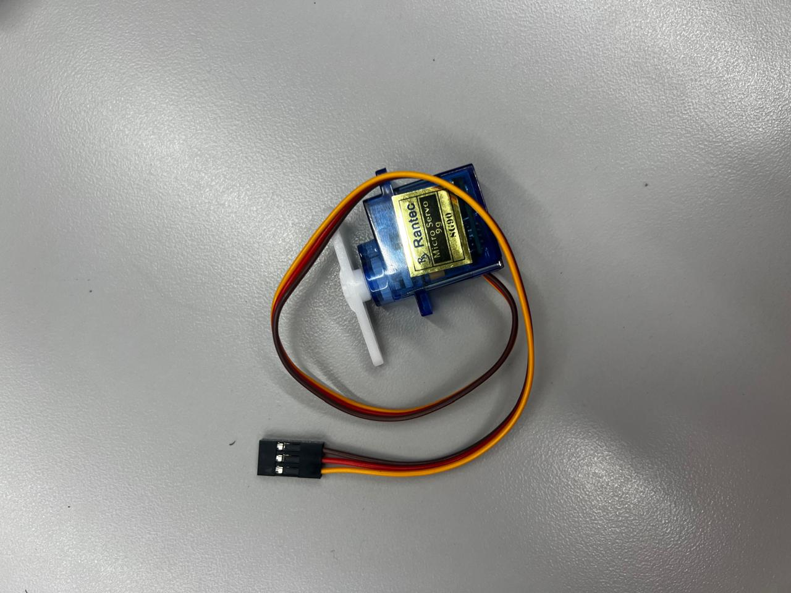

## ¿Qué es Arduino? 
Arduino es una plataforma de electrónica que utiliza una placa programable para crear diferentes proyectos. La placa tiene un microcontrolador que puede recibir información de sensores y controlar diferentes componentes, como luces, motores, botones, pantallas, etc. Se utiliza mucho para aprender programación y electrónica porque permite hacer que un programa controle objetos físicos.

### ¿Cómo se utiliza? 
Para utilizar Arduino, primero se conecta la placa a una computadora mediante un cable USB. Después, se escribe un programa en el Arduino IDE, que es el programa utilizado para programar la placa. Una vez terminado el código, se carga a Arduino y este empieza a ejecutarlo. Dependiendo de lo que se quiera hacer, se pueden conectar diferentes componentes, como un LED, un botón o un sensor. Por ejemplo, se puede programar Arduino para que cuando un sensor detecte movimiento, encienda una luz.

### Lista de materiales
#### Arduino Uno
Foto: 

Es la placa principal. Es donde se carga el programa y que controla todos los componentes conectados.

Protoboard (Breadboard)
Foto: 

Es una placa que permite conectar componentes sin tener que soldarlos. Sirve para armar y probar circuitos fácilmente.

Cables Jumper
Foto: 

Son cables pequeños que sirven para conectar Arduino con la protoboard y los diferentes componentes.

LED

Es una pequeña luz que Arduino puede encender y apagar mediante programación. Hay LEDs de diferentes colores.

Resistencias

Sirven para limitar la cantidad de corriente que pasa por un circuito. Por ejemplo, normalmente se coloca una resistencia junto a un LED para evitar que reciba demasiada corriente.

Botón (Push Button)
Permite enviar una señal a Arduino cuando se presiona. Por ejemplo, puedes programarlo para que al presionar el botón se encienda un LED.

Potenciómetro

Es una resistencia que se puede ajustar manualmente. Se puede utilizar, por ejemplo, para controlar el brillo de un LED o el volumen de un sonido.

Sensor ultrasónico HC-SR04
Sirve para medir distancias utilizando ondas de sonido. Arduino puede utilizarlo para detectar qué tan cerca está un objeto.

Servomotor

Es un motor que puede girar hasta una posición específica. Se utiliza en proyectos de robótica, puertas automáticas, brazos robóticos, etc.

Sensor DHT11 🌡️
Permite medir la temperatura y la humedad del ambiente. Arduino puede leer estos datos y mostrarlos en una pantalla.

Pantalla LCD
Sirve para mostrar información, como números, temperaturas, mensajes o resultados obtenidos por los sensores.

Buzzer (Zumbador) 🔊
Es un pequeño componente que produce sonidos. Puedes programarlo para hacer un pitido cuando ocurre algo, como cuando se presiona un botón.

Fotoresistencia (LDR)
Es un sensor que detecta la cantidad de luz que hay en el ambiente. Por ejemplo, puedes hacer que una lámpara se encienda automáticamente cuando oscurece.

## 1_Arduino Básico Salidas Digitales

## 2_Arduino Básico Entradas Digitales

## 3_Arduino Básico Servomotores

## Conclusión General

